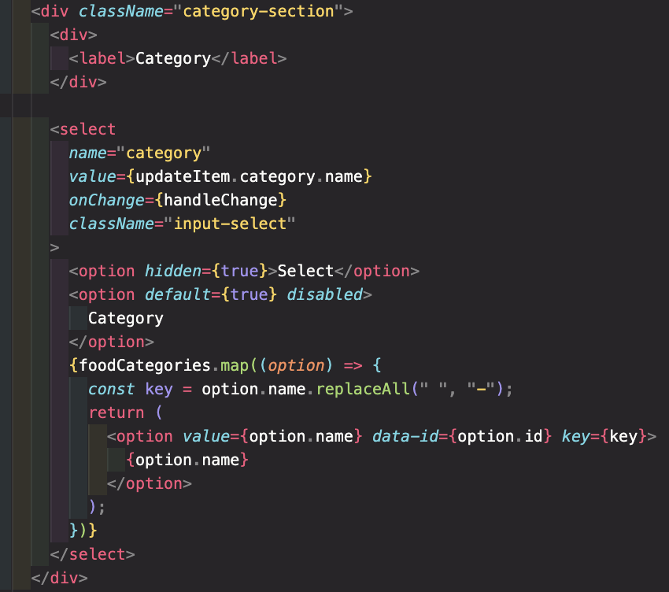
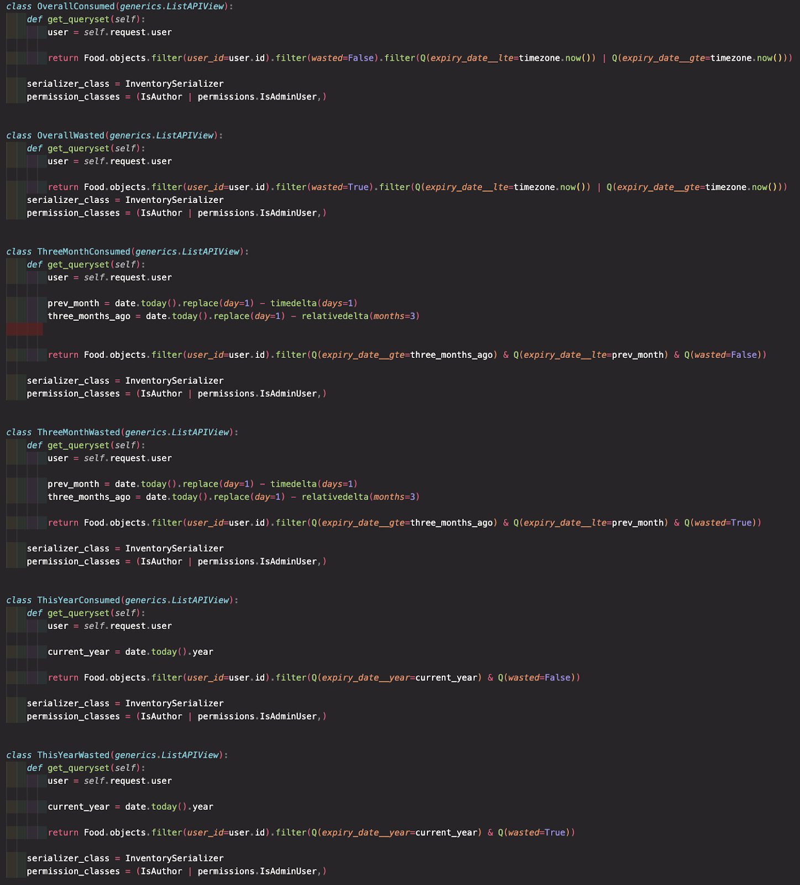

# Project 4: Readme

# Description

For the fourth project on General Assembly’s Software Engineering course, we were assigned two and half weeks to create a full-stack application using React on the front-end and Python and Django on the back-end. I was eager to journey a full-stack project on my own as I wanted to put to test everything I had learned over the past six months.

I gave great thought to creating an application that would have a positive impact not only on the individual level but also on a wider societal level. I wanted my small creation to contribute to the widening drive to use technology for good.

After much ideating, I landed on building a food expiry tracker. On the individual level, so many people struggle with wasting food. I know I have, on many an occasion, forgotten about an ingredient in the fridge. This application will not only help people to be conscious of the food they have and need to use up, but it will also help people to save money from food waste. This is especially important considering the current global context of soaring food and energy costs. On a societal level, the 1/3 of food never consumed not only devours earth’s resources and health, but just [25% of this food waste could feed 870 million people around the world](https://earth.org/facts-about-food-waste/). Though tackling food waste is a complex and multifaceted issue, exerted individual efforts to prevent food waste can have a ripple effect on reducing the global impact of food waste. My hope and end goal, therefore, is that this food expiry tracker application will have some utility in fighting food waste.

I decided to name the application Waste Not from the phrase, "waste not, want not." If you are unfamiliar with this phrase, it refers to being careful with your resources to ensure you have a remainder for when you require it.

The project's technical requirements were as follows:

1. Build a full-stack application by making your own backend and your own front-end
2. Use a Python Django API using Django REST Framework to serve your data from a Postgres database
3. Consume your API with a separate front-end built with React
4. Be a complete product which most likely means multiple relationships and CRUD functionality for at least a couple of models
5. (Implement thoughtful user stories/wireframes that are significant enough to help you know which features are core MVP and which you can cut)
6. Have a visually impressive design to kick your portfolio up a notch and have something to wow future clients & employers. ALLOW time for this
7. Be deployed online so it’s publicly accessible

### Technologies used

- HTML5
- CSS
- JavaScript (ES6)
- ReactJS
- Python
- PostgreSQL
- Django
- Poetry
- Miro
- dbdiagram.io
- Git
- GitHub

## Deployment link

The Waste Not application can be access here: https://waste-not-app.netlify.app/

## Planning

When thinking about some of the features I wanted to incorporate, I used Excalidraw for rough outlining. With the appreciation of simplicity in mind, I wanted to create a product that delivers on a central goal of tracking food freshness and food waste. I knew adding more features would diverge from the application’s purpose. Basically, I didn’t want to get to a point where the application was _doing the most_.

After a fair bit of mulling over the application’s architecture, I decided to divide the application into 7 broad sections:

1. Homepage and about
2. Signup and login
3. Dashboard
4. Inventory
5. Inventory item detail
6. Inventory search
7. User analytics/profile

To help me think about the typical steps a user interested in the application would take, I used Miro to create a user story. In a slightly unusual move, I embedded the application’s main sections, access authorisation rights (i.e., registered user vs. anon), user story, technical requirements, and future feature releases into a single document. This allowed me to get a bird’s eye view of the whole project and to see the connections between and across sections. It also allowed me to follow and aid the user on their journey from their visit to the homepage to tracking their food waste analytics by listing what needs to happen in each step. This plan of action keeps the journeying user at the forefront of my mind throughout the building process. See below for this user story map and zoomed-in images.

User story zoomed in part 1:

User story zoomed in part 2:

I used Todoist to break down each section into several further sub-sections. If a section contained issues that took a considerable amount of time to tackle, I moved on to another section and ensured that I circled back to fixing the buggy section.

The user story map informed the design of the database and its relationships. I created four tables using [dbdiagram.io](https://dbdiagram.io/): a food waste facts table for the three (randomised on refresh) facts on the homepage; a custom user model table; a food items table; and a food category table. As displayed below, each food item has a one-to-many relationship with the food category table. A food item will belong to a single category, and a single category can contain many food items. Additionally, each food item has a one-to-one relationship with the user table (i.e., each food item added links to the user who added or edited it).

The application’s CSS was designed on Exalidraw once the logic was complete. As the infographics' colourings informed the Waste Not application’s colour choices, I used [coolors.co](https://coolors.co/) to pick and arrange the colours. I browsed various blogs that explored font choices and selected the Raleway and Lato Google fonts as the application’s font choices.

Infographics and icons were sourced from [Flaticon](https://www.flaticon.com/) and [Freepik](https://www.freepik.com/). The source for each item is listed below:

Infographics:

- [Recycling shopping bag](https://www.freepik.com/free-vector/people-packing-organic-food-into-eco-bag_9176173.htm#page=2&query=food%20waste&position=0&from_view=author) by [pct.vector](https://www.freepik.com/author/pch-vector)
- [Family shopping](https://www.freepik.com/free-vector/muslim-family-buying-food-supermarket-arab-cartoon-characters-wheeling-shopping-cart-grocery-store-vector-illustration-retail-lifestyle-arab-people-concept_10613254.htm?query=food%20shopping#from_view=detail_alsolike) by [pct.vector](https://www.freepik.com/author/pch-vector)
- [Analytics](https://www.freepik.com/free-vector/man-with-laptop-analyzing-infographics-diagram-bar-chart-report-flat-vector-illustration-analysis-marketing-project-manager_10173189.htm#query=analytics&position=1&from_view=author) by [pct.vector](https://www.freepik.com/author/pch-vector)
- [Saving money](https://www.freepik.com/free-vector/happy-rich-banker-celebrating-income-growth_8609326.htm#page=2&query=analytics&position=1&from_view=author) by [pct.vector](https://www.freepik.com/author/pch-vector)
- [Packing shopping bag](https://www.freepik.com/free-vector/people-keeping-healthy-diet_8610283.htm#page=3&query=food&position=1&from_view=author) by [pct.vector](https://www.freepik.com/author/pch-vector)

Icons:

- [Profile icon](https://www.flaticon.com/free-icon/user_2105556) by [Sergei Kokota](https://www.flaticon.com/authors/sergei-kokota)
- [Warning icon](https://www.flaticon.com/free-icon/danger_9068306?related_id=9068306&origin=search) by [Graphics Plazza](https://www.flaticon.com/authors/graphics-plazza)
- [Waving icon](https://www.flaticon.com/free-icon/hello_3898671) by [Freepik](https://www.flaticon.com/authors/freepik)
- [Grains icon](https://www.flaticon.com/free-icon/bread_2713524) by [Freepik](https://www.flaticon.com/authors/freepik)
- [Meat and Fish icon](https://www.flaticon.com/free-icon/fish_4773069) by [Freepik](https://www.flaticon.com/authors/freepik)
- [Fruits and vegetables](https://www.flaticon.com/free-icon/healthy-food_1147883) icon by [Freepik](https://www.flaticon.com/authors/freepik)
- [Dairy icon](https://www.flaticon.com/free-icon/dairy-products_3050113) by [Freepik](https://www.flaticon.com/authors/freepik)
- [Snacks icon](https://www.flaticon.com/free-icon/nuts_7183763) by [Lapiyee](https://www.flaticon.com/authors/lapiyee)
- [Frozen food icon](https://www.flaticon.com/free-icon/frozen_2372135) by [Smashicons](https://www.flaticon.com/authors/smashicons)
- [Condiments icon](https://www.flaticon.com/free-icon/tomato-sauce_3075702) by [Freepik](https://www.flaticon.com/authors/freepik)
- [Beverages icon](https://www.flaticon.com/free-icon/soda_3184553) by [Freepik](https://www.flaticon.com/authors/freepik)
- [Edit icon](https://www.flaticon.com/free-icon/pen_1250615) by [Icongeek26](https://www.flaticon.com/authors/icongeek26)
- [Trash icon](https://www.flaticon.com/free-icon/delete_1214428) by [Kiranshastry](https://www.flaticon.com/authors/kiranshastry)

## Build/Code Process

### Custom User Model, Authentication, Sign up and Login

#### Users: Server

After setting up the initial files and dependencies, my first task was to create a custom user model. This provides flexibility to enhance Django’s inbuilt user model with additional fields. For this application, I wanted to include a name field. To do this, I went through the process of creating and registering a user application. I then added the name field as a CharField in the user model.

The CustomUser class was added to the settings file, and migrations made.

To register users within admin, I first needed to create user creation and user change forms. These forms were then imported within the admin file, which also held the fields to be displayed within admin.

For authentication, I used JWT authentication middleware because it pairs well with a React front-end. After installing pyjwt, I created an authentication file that will be checking for an authorisation header. Where there is no header, the user is classified as unauthorised and restricted from performing authorised actions. If there is a header but it doesn’t begin with Bearer, a permission denied error is returned that marks the authorisation header as invalid. If the header is correct, the Bearer part of the string is removed, the token decoded, and the user’s ID extracted to find the user in the database. If the user does not exist, or the token is invalid, a 403 response will be returned with either an invalid token or a user not found message. However, if a user is successfully found, a tuple will be returned containing the user and a token.

To enable users to sign up and log in, I first needed to create a serializer that validates the password and password confirmation fields for newly signed-up users.

Next, I created views that handle users registering and logging in. The register view will create a new user and either return a success message or the custom error implemented within the UserSerializer. The login view locates the user by email and verifies their password with the check_password function, and returns a created token if successful, and an error if not.

#### Users: Client

The user service utility file holds the sign-up and login functions. Upon successful registration or login, a token is created and added to local storage to keep the user logged in for 24 hours.

The login and sign-up pages contain forms that prevent submission if all the fields are not entered or do not pass validation. Within the login page, an error will occur if the password does not match the user’s password. Similarly, on the sign-up page, an error will be raised if the user already exists or their password isn’t secure enough.

### API Creation

The next order of business was to create and register the foods application, which would be housing the core functionalities of Waste Not. I created models for the food, category, and food waste facts tables. I then ran migrations and registered the application in admin.

It was important to first test if I could successfully create a user and add a food item linked to both the user and a food category.

I re-ran the test several times with typos to ensure that the first successful test was accurate.

Knowing that the models were in working order, I then moved on to creating the API. I first installed and enabled necessities such as Django Rest Framework and CORS and also added permissions to restrict certain functionalities.

#### Homepage

#### Homepage: server

As the homepage was to include three food waste facts randomised on refresh, I created a separate serializer for this feature.

I created three views: a read-only view that returns three randomised food waste facts; a create food waste view with admin-only permission; and a food waste detail view with admin-only permission.

As my food waste facts currently do not currently exceed 9 facts and are unlikely to reach beyond 30, I used the order_by method to return the randomised data. I acknowledge that this is an inefficient method for larger datasets.

#### Homepage: client

I called on the foodWasteFacts function from the food service file to retrieve the facts and then populate them within the homepage page using the map method.

### Inventory

#### Inventory: server

I then created serializers for the inventory and inventory detail features which reference the serializers that were created for the user and category models.

In the views file, the inventory and inventory detail data were set to return foods with an expiry date greater than or equal to today's date and a wasted status of null. This is because if a food has been updated as being consumed or wasted, it will be removed from the inventory and added to the user’s analytics page. I then applied permissions to restrict users to only being able to view and edit their posts.

Unexpectedly, the create and update functionalities proved to be quite the challenge due to the use of nested serializers. I ended up requiring support to untangle this complexity. More on this in the challenges section.

#### Inventory: client

Users navigate to the inventory page by clicking on the underscored inventory title in the dashboard. To add food to the inventory, users click on the plus sign on the inventory page, which will lead to the add food page.

The add food page allows users to enter a food item’s name, quantity, expiry date, and category. If all fields are not filled, the form prevents submission. As the category is a nested object, the form’s onChange function had to be modified to account for this.

The addAFood function in the food service file is imported within the add food page and called upon when adding a food item. Below is an example of a user adding kale to their inventory.

Once food items are added, they will appear as a list on the inventory page. This list is generated from a fetch request for the user’s added food items in the food service file. Below is an example of a user's inventory after adding several more foods.

Conditionals are set in the inventory page on a food item’s category to ensure the correct category image is applied.

When clicked, a food item will navigate to the item's detail page, where options to edit or delete the item are provided. To action any changes or deletions, the getFood or deleteFood function in the food service file is used.

To ensure that the foods which have their category updated do not overwrite the original category, the original IDs for each food category are added. The form is once again adjusted to account for the category being a nested object.

### Dashboard

#### Dashboard: server

The next section to tackle was the user’s dashboard. The dashboard displays foods expiring within the next seven days and if unactioned, expired foods whose waste status was not updated. I assigned colour-coded tags to each group of days. Red for foods expiring today, orange for foods expiring within 1 to 3 days, yellow for foods expiring within 4 to 5 days, and green for foods expiring within 6 to 7 days.

As you can see, the un-actioned API also requires a detail view to enable users to either update the expired food’s waste status or delete the food item.

#### Dashboard: client

When a user logs in or signs up, they will be navigated to their dashboard. The dashboard contains food items expiring within the next seven days and any expired foods without an updated waste status. The dashboard calls on several functions from the food service file for the page’s functionalities. See below for a snippet of the unactioned container.

Each clicked food item in the dashboard (including the unactioned) leads to the item’s detail page.

For the unactioned items that will appear in the dashboard, users will be able to click on the expired food item and update its waste status as either consumed or wasted. This will then update the user's food waste analytics page. Users also have the ability to delete the item by clicking on the trash can.

### Search

#### Search: server

The next feature to implement was enabling users to search for items within their inventory. I retrieved the search item from the primary key and took advantage of PostgreSQL’s full-text search capabilities so as to widen my returned search results. If, for example, a user's inventory contained 'blueberry' and 'blueberries' and they searched for either word, the search result would return both 'blueberry' and 'blueberries'. This is because SearchQuery focuses on the word root, whereas querying with icontains would only return the search item that contains the exact combination of letters entered.

#### Search: client

Users type the food item they’re looking for into a search bar which will set the value as the query variable using an onChange function. To prevent overloading the server with requests after each keystroke, I used a debouncer hook to limit the inventorySearch function to only run after 0.5 seconds. The inventorySearch function in the food service file is called on the queried food item to search for the item.

### User Analytics/Profile

#### User Analytics/Profile: server

The final user-specified functionality is tracking food consumption and waste. When a food item has been updated as either consumed or wasted, it will be updated on the user’s analytics/profile page. Depending on the expiry date, the total numbers for consumption and waste are categorised in one or multiple of the overall consumption and waste analytics for the following: overall consumed and overall wasted; overall consumed and overall wasted in the previous 3 months (this doesn’t include the current month); and overall consumed and overall wasted in the current year. Below is the code for returning this data.

Translating the SQL queries I made before I created these queries in Django was tremendously helpful (and fun in a puzzle-like way!).

#### User Analytics/Profile: client

Users navigate to their food waste analytics page/profile by clicking on the profile icon in the navbar. The analytics page will populate with data when a user updates a food item’s waste status. Retrieving this information are several GET requests in the food service file. See below for a snippet of the analytics page code which displays the overall consumed and wasted analytics.

An example of updating the waste status of three foods with an expiry date of 13th December 2022 (wasted), 13th October 2022 (consumed), and 13th December 2021 (consumed):

The user analytics/profile page also contains the logout functionality, which will remove the stored token from local storage when a user clicks the logout button.

### Challenges

The most challenging part of the project ended up being the creating and updating a food item functionalities. Because I used a nested serializer for the inventory, I needed to write logic describing how the inventory serializer should deal with nested data. I thought I had this sorted out, but unfortunately, I could not identify the root cause of the issue. After a week and some change of fiddling around with the bug, I sought assistance from my instructor, who pointed out that the validator (strangely) required a string passed in for the user. This was then counteracted by getting the user from the request in the inventory serializer’s create method, and adding a throwaway user in the inventory create and update view.

Another challenge was creating dynamic code in Django. Quite a few of the sections did not live up to the DRY code principles, which I primarily blame on my newbie status with Python, Django, and PostgreSQL. As I continue on my learning journey with these technologies, I aim to revisit this project to make the code look less like an eye sore.

### Wins

I’m beyond happy to have completed what I initially set out to achieve with Waste Not. I’m especially happy with the dashboard and user analytics page, as I anticipated these parts to be the most challenging (spoiler alert: it wasn’t).

I’m also quite chuffed about the design of the Waste Not, which came out exactly as I had hoped. Although planning a project’s design can (at times) be a little tedious, I really do enjoy the whole process as someone who adores art and design.

### Key Learnings/Takeaways

Waste Not significantly increased my programming and design confidence. Planning Waste Not and seeing it come to fruition has been such an amazing experience. I’m beyond proud to have created a full-stack application using a language (Python) and database type (non-relational, i.e., SQL) I learned in just three weeks!

This project has added so many critical pieces to the jigsaw puzzle of programming. A much clearer and more fascinating picture has emerged in the puzzle, which has spearheaded my drive and curiosity to keep adding pieces to the puzzle by building more programming XP.

### Bugs

On a hard refresh or when a non-existent inventory item’s URL path is entered, the already signed-in user is prompted to sign in again instead of being redirected to their dashboard. Apart from the homepage, all of the pages are wrapped in protected routes that will check for a signed-in user before granting access. I believe this bug results from the millisecond delay in reading the authentication token saved in local storage when a refresh or URL path is actioned. I aim to further explore this potential cause of the bug. Where unsuccessful in diagnosing the root cause of the bug and its fix, I will seek further assistance from Stack Overflow.

### Future Improvements

To further enhance the Waste Not application, I’d love to add the following features:

- Add a blog section with weekly tips and recipe ideas for the most commonly wasted foods
- Add a Google sign-up and sign-in option
- Edit and delete food within the same page
- Notify users of expiring foods using a window pop up
- Have different inventory types such as fridge, freezer, or pantry
- Provide users with analytics on their most commonly wasted food
